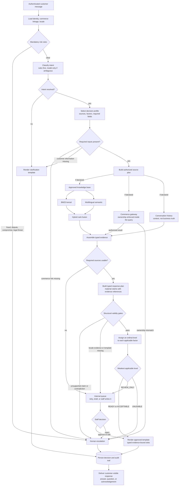

# Support agent — design decisions

Decisions taken before the support-agent workflow was implemented, and
updated as they change.
It records why, not how. The code layout will move; these decisions should not.

## What the agent does

A customer asks a question on the DornaShop storefront. The service answers
it, or declines and says why.

Deciding which is the hard part.

## Four outcomes, not two

| Outcome | When |
|---|---|
| Direct response | Evidence is strong enough to answer without supervision |
| Clarification | The customer has to tell us something first |
| Internal review | Nothing is sent yet. Staff review a draft, retry a failed source, or redirect |
| Human escalation | Automation must not proceed |

A missing order number, a source outage and a fraud report all mean "I can't
answer", and all need different handling.

## The path a request takes



Three things the diagram makes plainer than prose can. Risk rules run before
anything else, so a payment dispute never reaches a model. Ownership is
enforced inside the commerce query, so another customer's order is never
fetched and then rejected. And nothing is delivered before the decision is
persisted.

Declared sources are queried concurrently. Claims are constructed in the
response plan, which is why the validity gates sit after it — before that
point there is evidence, but nothing yet asserting anything.

## Where answers come from

Three sources, each authoritative for a different kind of claim:

| Source | Authoritative for |
|---|---|
| Commerce gateway | Customer, product, cart and order facts |
| Approved knowledge base | Policies and procedures |
| Support database | Conversation history and prior tickets |

"Commerce" here means the shop's own operational data — customers, products,
carts and orders — as opposed to policy, which applies to everyone and rarely
changes.

**The source is chosen before anything is ranked**, and choosing it is what
intent detection is for. The intent selects a decision profile; the profile
declares which sources are authoritative for the claim being made.

```text
question -> intent -> decision profile -> sources to query
                                       -> ranking, inside the knowledge base only
```

Ranking judges words, and words are a poor guide to authority. "Where is my
order" matches every word of a shipping policy saying orders usually arrive
in two to three days, and none of the order record saying `shipped, DPD,
FR123456`. One ranked pile returns the document that cannot answer the
question, confidently.

Priority therefore follows the claim. Order status goes to commerce; return
policy goes to the knowledge base.

The classifier is allowed to return no intent. "I returned my order last
week, why haven't I got my money back?" is plausibly a return status, a
refund status or a payment dispute, and guessing picks the wrong sources
before anything else runs. Below a confidence threshold the request clarifies
rather than proceeding on a guess.

A message can also carry more than one intent — "where is my order, and can I
return it once it arrives?". Where the highest-risk intent is escalatory, it
wins outright. Otherwise the request clarifies and asks which to answer
first. Answering both in one turn is out of scope.

A conflict is two admissible records disagreeing about **the same material
claim, the same scope, and the same effective time**. An older conversation
saying an order was processing does not conflict with a commerce result
saying it shipped — the order moved. Two policy versions with different
effective dates do not conflict either. Without the time dimension, every
order that ever changed state would escalate.

A real conflict that cannot be resolved escalates. It is never settled by
taking the higher retrieval score.

The support database is authoritative that a message or ticket **exists**. It
is never authoritative for a claim made inside one. History can establish
that the customer previously referred to order 4471; it can never establish
that 4471 was delivered. A customer asserting "you already refunded me" in an
earlier message is not evidence of a refund.

### Commerce data

A typed, asynchronous adapter over DummyJSON, behind a protocol so tests can
substitute timeout, unavailable and malformed-response implementations.
Failure behaviour is proven by those tests, not by waiting for a real outage.

DummyJSON carts are **carts**, not orders. They carry no status, carrier,
tracking number or dates, and are never presented as order state. Synthetic
order records come from a separately labelled demo provider that marks its
own responses as synthetic.

Ownership is a query parameter, not a check afterwards. The adapter is asked
for an order belonging to the authenticated customer, so a record they may
not see is never fetched and then discarded. A mismatch returns a typed
result, not the record.

A customer can be authenticated without being linked to any commerce record,
since the linkage is nullable. Commerce-backed questions then escalate. They
do not clarify: the customer cannot supply an internal identifier, and asking
them to would expose our own data-modelling gap. A ticket is raised so staff
can repair the link.

Escalating is not the same as saying nothing. The customer is told their shop
account is not yet connected and that someone is fixing it, from an approved
template. Every escalation carries an acknowledgement; silence is not one of
the four outcomes.

## Reliability is a level, not a probability

Four ordinal levels: `READY`, `ACCEPTABLE`, `REVIEW_ONLY`, `UNUSABLE`.

The overall level is the **weakest applicable factor**, not an average.
Averaging lets three strong dimensions hide one dangerous one, and "the
retrieval was excellent, but the delivery date was invented" must never come
out as a good answer.

We do not publish a percentage. The available evidence does not support
calibrated probabilities, and `0.83` would be invented precision.

The weakest level maps directly to a route:

| Weakest applicable factor | Route |
|---|---|
| `READY` | Direct response |
| `ACCEPTABLE` | Direct response |
| `REVIEW_ONLY` | Internal review |
| `UNUSABLE` | Human escalation |

It is an automation-readiness judgement, not a correctness estimate. The API
publishes it as an ordered category with its scale attached, so that nothing
reads as a probability:

```json
"reliability": { "level": "acceptable", "ordinal": 2, "scale": 3 }
```

`REVIEW_ONLY` means a usable draft exists. `UNUSABLE` means no automation
output is worth showing anyone, and a human ticket is created instead.

`READY` and `ACCEPTABLE` share a route today. They stay distinct because the
difference is worth measuring — how often answers go out on pristine evidence
versus evidence that is imperfect but safe — and because tightening the bar
later should be a routing change, not a rescoring one.

The levels and the per-factor rubric for what each one means are defined in
`app/agent/reliability.py`. The reason-code and material-claim enumerations
belong there too when they are written, rather than being spelled out here
where a second copy would drift.

## Gates run before any scoring

Some conditions have a known outcome and are never scored:

| Condition | Outcome |
|---|---|
| Material claim with no supporting evidence | Escalate |
| Material contradiction between sources | Escalate |
| Payment dispute, fraud, account compromise | Escalate |
| Request touching another customer's data | Reject and escalate |
| Required customer-supplied information missing | Clarify |
| Required source unavailable | Internal review |

A **material** claim is one about identifiers, ownership, status, amounts,
dates, availability, policy terms, account security, or an action taken or
promised. Empathy and connective phrasing are not material.

## Which factors apply is decided in advance

Each intent has a static profile declaring which factors apply to it. Order
status does not use knowledge-base relevance; policy questions require it.

The matrix is configuration, not prose. It belongs in code as a typed
structure the tests assert against, not as a table here. Three rules keep it
safe:

- `N/A` is assigned only by the profile, never at runtime.
- A required factor missing at runtime is `UNUSABLE`.
- Only required factors enter the minimum. A profile may declare a source
  contextual, and a contextual source failing must not downgrade an answer
  the required sources already support. A history lookup timing out cannot
  block an order status the commerce gateway answered completely.

Without them, a source failing to return a value could make that factor
"inapplicable" and *improve* the result. Under weakest-link aggregation that
would be silent and severe.

## Customer-visible text comes from approved templates

No model-generated prose reaches a customer.

The reason is that connective language carries claims. "Your parcel should
arrive shortly" is a delivery prediction, and calling it phrasing does not
make it harmless. If the model cannot write to the customer, it cannot
invent.

Responses are assembled from an approved, versioned template plus typed slots,
each material slot carrying a reference to the evidence that supports it.

Slot values must already be structured. A knowledge-base entry saying "items
can be returned within 30 days" cannot safely fill `return_window_days=30`
unless something extracts the number, and a model extracting it puts the
hallucination back one step earlier, where it is harder to see.

A figure is therefore authored once, in the claims. The searchable sentences
name it rather than repeat it, and are rendered when the corpus loads:

```toml
prose_template = "You can return most items within {return_window_days} days."

[claims]
return_window_days = 30
eligibility = "standard_items"
```

The rendered text is what retrieval searches; the claims are what fill slots.
Neither is a copy of the other, so they cannot come to disagree.

The first version of this checked instead of rendering — every numeric claim
had to appear somewhere in the prose. It passed when the figure appeared in
an unrelated sentence, reporting a consistency it had not established. A
template naming its figures makes the copying error inexpressible rather than
detectable, at the price of banning literal digits: any number worth stating
in policy text has to become a claim.

Meaning is not covered. A template reading "returns are forbidden for
{return_window_days} days" renders the right figure into the wrong rule, and
only approval catches that.

Grounding validation is therefore a set of structural checks — is the template
approved, does the locale match, does every material slot cite evidence, does
the evidence contain the value — and not an attempt to detect falsehood in
prose.

### What the model does

A Hugging Face embedding model provides multilingual semantic retrieval over
the knowledge base, alongside lexical BM25 search.

The two are not interchangeable, and the reliability level treats them
asymmetrically. BM25 returning nothing is a fact: the question and the
document share no words. A low cosine similarity is not the equivalent fact,
because there is no similarity below which a document stops being returned —
embeddings of unrelated text sit well above zero, so meaning always has a
nearest entry to offer. A question the corpus cannot answer at all therefore
looks exactly like a question it can answer in different words.

Words corroborating meaning is evidence, and reaches a customer. Meaning
alone is a ranking, and reaches internal review. Whether the entry actually
carries the claim being asked for is settled by coverage, which has a
definite answer where a similarity has only a degree. A classifier resolves
ambiguous non-sensitive intent when deterministic rules cannot. A generative
model writes staff-only drafts and history summaries.

No model is a source of business facts, and none writes to a customer.

That holds through review. A staff member reading a model draft is not
approving prose for delivery — the draft is an aid to reading the evidence.
Approving means confirming the evidence, the template and the slot values,
after which the response is rendered from the template like any other. Staff
who want to say something the templates cannot express answer through the
human channel, which is not agent output. There is no path from generated
prose to a customer.

Sensitive-situation detection runs *before* model classification. The
classifier may add a risk flag; it can never clear one that rules established.

## Locale

Answers are given in the customer's locale, and what that requires depends on
what is being said.

A structured policy fact is language-independent. `return_window_days = 30`
plus an approved French template renders directly, because nothing is being
translated — a number is being placed in approved French wording.

A free-form explanation is not. Where the answer needs policy prose that
exists only in another language, the request goes to internal review. A
machine translation of policy text is not an approved policy.

## Evaluation comes before implementation

A set of example questions, each declaring the expected intent, risk flags,
source plan, outcome, reason code and permitted claims. It runs in CI against
deterministic stubs, so results do not vary with model output.

This is written first because it is the only way to know the design is
consistent. It has already earned its place: the first version of the
confidence model asserted outcomes its own arithmetic could not produce, and
writing the cases is what exposed it.

Mandatory escalation cases must reach 100% recall on this suite, and no run
may violate a hard gate. Both are test invariants over fixed cases, not
measurements of real-world recall — recognising a fraud report from free text
is exactly the part a fixed suite cannot prove.
Retrieval quality is measured separately and must not be confused with
routing correctness.

## Every decision is recorded before anything is sent

Each request persists its intent, risk flags, source plan, evidence
references, reliability factors, route and reason code, whether or not a
customer ever sees a response.

This happens before delivery. A response that reached a customer without a
record of why is the one case that cannot be investigated afterwards, and
support systems are investigated after the fact by definition.

## Considered and rejected

| Rejected | Reason |
|---|---|
| Weighted-average confidence | Strong dimensions mask dangerous ones |
| A percentage confidence score | Invents precision the evidence cannot support |
| One global source priority | "Where is my order" has one authoritative source regardless of word overlap |
| JSONPlaceholder | Its posts are not support tickets; the mapping would be fiction |
| Hugging Face's model catalogue as the domain | Model recommendation, not customer support |
| All data held locally | No typed external boundary, so timeouts, malformed responses and degraded-mode behaviour cannot be exercised |
| Fixtures as a fourth source | They are test doubles; stale cache is a commerce response with a freshness flag |
| Model-written text to customers | Connective phrasing smuggles in unbacked claims |

## Scope

Six vertical slices: product information, return policy, order status,
payment dispute, ambiguous request, and a medium-confidence review path. A
small bilingual corpus, not a full parallel translation.

Six things that work end to end are worth more than twenty that half-work.
