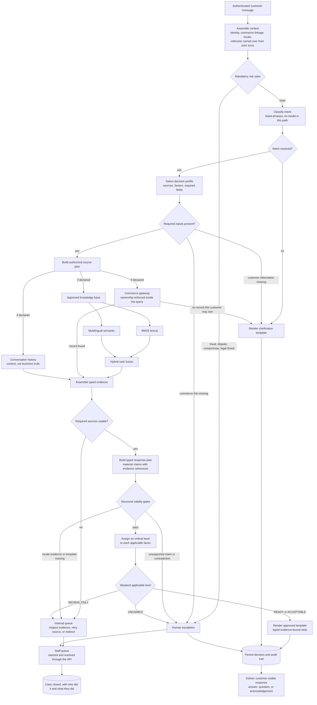

<p align="center">
  
</p>

# Support agent — design decisions

Decisions taken before the support-agent workflow was implemented, and
updated as they change.
It records why, not how. The code layout will move; these decisions should not.

## What the agent does

A customer asks a question on the DornaShop storefront. The service answers
it, or declines and says why.

Deciding which is the hard part.

## Four outcomes, not two

| Outcome | When |
|---|---|
| Direct response | Evidence is strong enough to answer without supervision |
| Clarification | The customer has to tell us something first |
| Internal review | Nothing is sent yet. Staff inspect the evidence, retry a failed source, or redirect |
| Human escalation | Automation must not proceed |

A missing order number, a source outage and a fraud report all mean "I can't
answer", and all need different handling.

## The path a request takes



Three things the diagram makes plainer than prose can. Risk rules run before
anything else, so a payment dispute never reaches a model. Ownership is
enforced inside the commerce query, so another customer's order is never
fetched and then rejected. And nothing is delivered before the decision is
persisted.

A request is planned for by the source that owns its claim, and today each
planner reads one. Concurrency is what several declared sources would call
for and is not what happens: written policy is ranked, or a row is fetched,
and no request does both. Said plainly because the alternative is a document
implying a fan-out nobody would find in the code.

Claims are constructed in the response plan, which is why the validity gates
sit after it — before that point there is evidence, but nothing yet asserting
anything.

## Where answers come from

Three sources, each authoritative for a different kind of claim:

| Source | Authoritative for |
|---|---|
| Commerce gateway | Customer, product, cart and order facts |
| Approved knowledge base | Policies and procedures |
| Support database | Conversation history and prior tickets |

"Commerce" here means the shop's own operational data — customers, products,
carts and orders — as opposed to policy, which applies to everyone and rarely
changes.

**The source is chosen before anything is ranked**, and choosing it is what
intent detection is for. The intent selects a decision profile; the profile
declares which sources are authoritative for the claim being made.

```text
question -> intent -> decision profile -> sources to query
                                       -> ranking, inside the knowledge base only
```

Ranking judges words, and words are a poor guide to authority. "Where is my
order" matches every word of a shipping policy saying orders usually arrive
in two to three days, and none of the order record saying `shipped, DPD,
FR123456`. One ranked pile returns the document that cannot answer the
question, confidently.

Priority therefore follows the claim. Order status goes to commerce; return
policy goes to the knowledge base.

Recognising nothing is a permitted answer. "I returned my order last week,
why haven't I got my money back?" is plausibly a return status, a refund
status or a payment dispute, and guessing picks the wrong sources before
anything else runs, so an unrecognised request is asked about rather than
placed. A model was evaluated for this and could not do it; see *Considered
and rejected*.

A message can also carry more than one intent — "where is my order, and can I
return it once it arrives?". Where the highest-risk intent is escalatory, it
wins outright. Otherwise the request clarifies and asks which to answer
first. Answering both in one turn is out of scope.

A conflict is two admissible records disagreeing about **the same material
claim, the same scope, and the same effective time**. An older conversation
saying an order was processing does not conflict with a commerce result
saying it shipped — the order moved. Two policy versions with different
effective dates do not conflict either. Without the time dimension, every
order that ever changed state would escalate.

A real conflict that cannot be resolved escalates. It is never settled by
taking the higher retrieval score.

The support database is authoritative that a message or ticket **exists**. It
is never authoritative for a claim made inside one. History can establish
that the customer previously referred to order 4471; it can never establish
that 4471 was delivered. A customer asserting "you already refunded me" in an
earlier message is not evidence of a refund.

### History is read twice, for two different things

Resolving what a message refers to is not answering it. "Is it still
available?" names no product, and the previous turn may name one. Reading
that is context assembly, and it happens **before** triage, which is why the
flow above loads referents in its first step and why triage receives what is
already known rather than going to find out.

The alternative was letting triage query history when a required input is
missing. That was rejected: triage exists to decide which sources a request
may touch, and a triage that reads a source to reach its decision has already
spent the guarantee it was there to provide. Nothing is fetched on a message's
behalf until the request has been placed.

So history appears in two roles with different authority, and the difference
is what it is being asked for. Before triage it supplies an identifier the
customer already gave us — a fact about the conversation, which history owns.
After a request proceeds it is a contextual source, able to colour an answer
and never to be the reason for one. In neither role does it establish a
business fact: a resolved product reference still sends the request to
commerce to find out whether that product is in stock.

### Commerce data

A typed, asynchronous protocol, so tests can substitute timeout, unavailable
and malformed-response implementations. Failure behaviour is proven by those
tests rather than by waiting for a real outage.

**What ships behind it is a local provider of invented rows, and no HTTP
client.** Every row it returns carries a flag saying it was made up, and that
flag travels through the citation into the stored case, so a reply resting on
one can always be told from a reply resting on a real purchase. It is refused
outright in a production process.

An adapter over DummyJSON was planned and is not written. Two things follow
from saying so rather than leaving the earlier sentence standing. DummyJSON
carts are **carts**: no status, no carrier, no tracking number, no dates, so
they could never have answered where an order is, and the synthetic provider
would have been needed beside them regardless. And *live* and *invented* are
different claims — DummyJSON's catalogue is mock data too, so an HTTP client
would have moved where the rows come from without making any of them real.

What that costs is stated plainly under *Considered and rejected*.

Ownership is a query parameter, not a check afterwards. The adapter is asked
for an order belonging to the authenticated customer, so a record they may
not see is never fetched and then discarded.

**A reference matching nothing and a reference matching somebody else's order
come back as the same value.** Not as a courtesy to whoever asked, but
because the question named the customer, so the difference was never
established and there is nothing to disclose. Two outcomes would be an oracle:
ask about a reference as somebody who owns nothing, ask again as somebody who
owns one thing, and the pair reports whether that reference exists. Repeat and
the shop's order numbers are enumerated a question at a time. The result type
has no field to hold the distinction in.

This is a change from an earlier version of this document, which routed an
ownership mismatch to a human. That described a check performed after the
fact, which is not what the adapter does. The customer is asked to check the
reference instead — a question they can act on, and one that says nothing
either way about whose order it might be. An upstream service that refuses a
record without revealing it could be recorded separately for staff; nothing
does that today, and no second lookup is made to manufacture the distinction.

A customer can be authenticated without being linked to any commerce record,
since the linkage is nullable. Commerce-backed questions then escalate. They
do not clarify: the customer cannot supply an internal identifier, and asking
them to would expose our own data-modelling gap. A ticket is raised so staff
can repair the link.

Escalating is not the same as saying nothing. The customer is told their shop
account is not yet connected and that someone is fixing it, from an approved
template. Every escalation carries an acknowledgement; silence is not one of
the four outcomes.

## Reliability is a level, not a probability

Four ordinal levels: `READY`, `ACCEPTABLE`, `REVIEW_ONLY`, `UNUSABLE`.

The overall level is the **weakest applicable factor**, not an average.
Averaging lets three strong dimensions hide one dangerous one, and "the
retrieval was excellent, but the delivery date was invented" must never come
out as a good answer.

We do not publish a percentage. The available evidence does not support
calibrated probabilities, and `0.83` would be invented precision.

The weakest level maps directly to a route:

| Weakest applicable factor | Route |
|---|---|
| `READY` | Direct response |
| `ACCEPTABLE` | Direct response |
| `REVIEW_ONLY` | Internal review |
| `UNUSABLE` | Human escalation |

It is an automation-readiness judgement, not a correctness estimate. The API
publishes it as an ordered category with its scale attached, so that nothing
reads as a probability:

```json
"reliability": { "level": "acceptable", "ordinal": 2, "scale": 3 }
```

`REVIEW_ONLY` means the evidence is useful but needs a colleague's judgement.
`UNUSABLE` means automation must not answer, and a human ticket is created
instead.

`READY` and `ACCEPTABLE` share a route today. They stay distinct because the
difference is worth measuring — how often answers go out on pristine evidence
versus evidence that is imperfect but safe — and because tightening the bar
later should be a routing change, not a rescoring one.

The levels and the per-factor rubric for what each one means are defined in
`app/agent/reliability.py`, and the reason codes in `app/agent/reasons.py` —
separately, because a code explains why a request went somewhere and most of
them have nothing to do with how reliable an answer was. The material-claim
enumeration belongs beside them when it is written, rather than being spelled
out here where a second copy would drift.

## Gates run before any scoring

Some conditions have a known outcome and are never scored:

| Condition | Outcome |
|---|---|
| Material claim with no supporting evidence | Escalate |
| Material contradiction between sources | Escalate |
| Payment dispute, fraud, account compromise | Escalate |
| Request naming a record this customer may not see | Clarify — see below |
| Required customer-supplied information missing | Clarify |
| Required source unavailable | Internal review |

The row about another customer's data is the one that changed. Escalating
described a check made after the record came back, and ownership sits inside
the query instead, so the difference between a reference belonging to
somebody else and a reference belonging to nobody is never established. One
outcome covers both and the customer is asked to check what they typed. The
reasoning is under *Commerce data*; this table said the older thing for
longer than the paragraph did.

A **material** claim is one about identifiers, ownership, status, amounts,
dates, availability, policy terms, account security, or an action taken or
promised. Empathy and connective phrasing are not material.

## Which factors apply is decided in advance

Each intent has a static profile declaring which factors apply to it. Order
status does not use knowledge-base relevance; policy questions require it.

The matrix is configuration, not prose. It belongs in code as a typed
structure the tests assert against, not as a table here. Three rules keep it
safe:

- `N/A` is assigned only by the profile, never at runtime.
- A required factor missing at runtime is `UNUSABLE`.
- Only required factors enter the minimum. A profile may declare a source
  contextual, and a contextual source failing must not downgrade an answer
  the required sources already support. A history lookup timing out cannot
  block an order status the commerce gateway answered completely.

Without them, a source failing to return a value could make that factor
"inapplicable" and *improve* the result. Under weakest-link aggregation that
would be silent and severe.

## Customer-visible text comes from approved templates

No model-generated prose reaches a customer.

The reason is that connective language carries claims. "Your parcel should
arrive shortly" is a delivery prediction, and calling it phrasing does not
make it harmless. If the model cannot write to the customer, it cannot
invent.

Responses are assembled from an approved, versioned template plus typed slots,
each material slot carrying a reference to the evidence that supports it.

Slot values must already be structured. A knowledge-base entry saying "items
can be returned within 30 days" cannot safely fill `return_window_days=30`
unless something extracts the number, and a model extracting it puts the
hallucination back one step earlier, where it is harder to see.

A figure is therefore authored once, in the claims. The searchable sentences
name it rather than repeat it, and are rendered when the corpus loads:

```toml
prose_template = "You can return most items within {return_window_days} days."

[claims]
return_window_days = 30
eligibility = "standard_items"
```

The rendered text is what retrieval searches; the claims are what fill slots.
Neither is a copy of the other, so they cannot come to disagree.

The first version of this checked instead of rendering — every numeric claim
had to appear somewhere in the prose. It passed when the figure appeared in
an unrelated sentence, reporting a consistency it had not established. A
template naming its figures makes the copying error inexpressible rather than
detectable, at the price of banning literal digits: any number worth stating
in policy text has to become a claim.

Meaning is not covered. A template reading "returns are forbidden for
{return_window_days} days" renders the right figure into the wrong rule, and
only approval catches that.

Grounding validation is therefore a set of structural checks — is the template
approved, does the locale match, does every material slot cite evidence, does
the evidence contain the value — and not an attempt to detect falsehood in
prose.

### What the model does

A Hugging Face embedding model provides multilingual semantic retrieval over
the knowledge base, alongside lexical BM25 search.

The two are not interchangeable, and the reliability level treats them
asymmetrically. BM25 returning nothing is a fact: the question and the
document share no words. A low cosine similarity is not the equivalent fact,
because there is no similarity below which a document stops being returned —
embeddings of unrelated text sit well above zero, so meaning always has a
nearest entry to offer. A question the corpus cannot answer at all therefore
looks exactly like a question it can answer in different words.

Words corroborating meaning is evidence, and reaches a customer. Meaning
alone is a ranking, and reaches internal review. Whether the entry actually
carries the claim being asked for is settled by coverage, which has a
definite answer where a similarity has only a degree.

Intent and risk are decided by listed phrases, with no model in either path.
`IntentClassifier` describes the shape one would have to take to be admitted
and nothing implements it, which is a conclusion rather than an unfinished
task. No generative model is wired into the service.

No model is a source of business facts, and none writes to a customer.

That holds through review. When evidence was assessed, a staff member receives
it with the citations and per-factor ratings that explain why automation
stopped. This API lets them claim the case and record how it was resolved; it
does not draft, edit, approve or deliver a reply. If staff answer the customer,
they do so through the human channel outside this service.

Sensitive-situation detection is the deterministic rules alone. Nothing a
model returns can raise or lower a risk, because no model is asked. What that
buys and what it costs are set out under *What the risk detector knows, and
what it does not*.

Four situations qualify: payment disputes, suspected fraud, account
compromise, and legal threats. A message naming one of them escalates unless
the sentence is asking about policy in general — and a customer describing
their own account overrules that, since one sentence can do both. "How do you
protect accounts when mine was hacked yesterday?" is a report.

The two ways of being wrong here are not equally expensive. Sending something
harmless to a person costs a few seconds and a slower reply; missing a real
report costs considerably more. The rules lean that way deliberately, and
negation is past what phrase matching can do, so "I was not charged twice"
reaches somebody. That is a known false positive with a test naming it, not
an oversight.

### What the risk detector knows, and what it does not

Risk is decided by listed wordings and nothing else. There is no model in this
path, and the reason is recorded under *Considered and rejected*.

A message escalates when it carries a wording from one of the four categories,
unless the sentence carrying it is asking about the subject rather than
reporting it — and a customer describing their own account in the past tense
overrules that, since one sentence can do both.

The bound follows from the method: **a wording nobody listed is a wording
nobody catches.** "An individual has been helping themselves to my funds" is a
real report in words the lists do not hold, and it proceeds as an ordinary
message. That is accepted for this version, and it is the cost of the
alternative having been measured and rejected rather than assumed.

Two things keep the bound honest. Every category is tested as a **pair** — the
same subject asked about and reported, in English and French — because either
half alone passes for the wrong reason: a rule that never fires satisfies the
questions, and one that always fires satisfies the reports. And the lists lean
towards escalating, so "I was not charged twice" reaches a person. Negation is
past what phrase matching can do, and a few seconds of somebody's attention is
the cheaper of the two mistakes.

Extending it means adding wordings and a pair to prove them, which is the only
maintenance this design asks for and the only one it can be trusted to receive.

## Locale

Answers are given in the customer's locale, and what that requires depends on
what is being said.

A structured policy fact is language-independent. `return_window_days = 30`
plus an approved French template renders directly, because nothing is being
translated — a number is being placed in approved French wording.

A free-form explanation is not. Where the answer needs policy prose that
exists only in another language, the request goes to internal review. A
machine translation of policy text is not an approved policy.

## Evaluation comes before implementation

A set of example questions, each declaring the expected intent, risk flags,
source plan, outcome, reason code and permitted claims. It runs in CI against
deterministic stubs, so results do not vary with model output.

This is written first because it is the only way to know the design is
consistent. It has already earned its place: the first version of the
confidence model asserted outcomes its own arithmetic could not produce, and
writing the cases is what exposed it.

Mandatory escalation cases must reach 100% recall on this suite, and no run
may violate a hard gate. Both are test invariants over fixed cases, not
measurements of real-world recall — recognising a fraud report from free text
is exactly the part a fixed suite cannot prove.
Retrieval quality is measured separately and must not be confused with
routing correctness.

## Every decision is recorded before anything is sent

What a member of staff does next is outside this API. They see the case, take
it on and record what they did; composing and sending a reply happen in the
tools they already use. The alternative was an author-review-deliver flow
here, and the honest position is that it was not built rather than that it is
implied by a diagram.


Each request persists its intent, risk flags, source plan, evidence
references, reliability factors and route, whether or not a customer ever sees
a response.

A reason code accompanies every outcome except a direct answer. That exception
is deliberate. A reason names what stopped a request from being answered
normally, and an answer given normally was stopped by nothing; a code invented
to fill the column would be counted alongside the real ones and would make
"how often do we escalate for missing coverage" a question about how many
requests succeeded. What explains a delivery is the factor record, which is
kept for every outcome and is where the case for sending it actually lives.

This happens before delivery. A response that reached a customer without a
record of why is the one case that cannot be investigated afterwards, and
support systems are investigated after the fact by definition.

## Considered and rejected

| Rejected | Reason |
|---|---|
| Weighted-average confidence | Strong dimensions mask dangerous ones |
| A percentage confidence score | Invents precision the evidence cannot support |
| One global source priority | "Where is my order" has one authoritative source regardless of word overlap |
| JSONPlaceholder | Its posts are not support tickets; the mapping would be fiction |
| Hugging Face's model catalogue as the domain | Model recommendation, not customer support |
| All data held locally | Rejected for the knowledge base, and it is what commerce currently does. See below |
| Fixtures as a fourth source | They are test doubles; stale cache is a commerce response with a freshness flag |
| Model-written text to customers | Connective phrasing smuggles in unbacked claims |
| A model deciding risk or intent | Measured; it could not tell a report from a question about the same subject. See below |

### The external boundary, and where it actually is

Holding everything locally was rejected on the grounds that a typed external
boundary is the only way to exercise timeouts, malformed responses and
degraded-mode behaviour. That reasoning stands, and commerce does not
currently satisfy it: its rows come from a table in this repository.

The boundary exists elsewhere and is real. The embedding adapter calls a
hosted model over the network, splits failures by whether a retry could
differ, degrades to lexical search when the answer might come later, and
halts the process when it never will. Malformed responses are refused field
by field. That is the behaviour the rejection was written to secure, and it
is exercised.

So the honest statement is narrower than the original: **this project has one
external boundary, not two.** Commerce keeps the same protocol, the same
failure taxonomy and the same substitutable tests, which is what an HTTP
client would need in order to be dropped in — the seam is built and nothing
is behind it. That is a smaller claim than the one this document made before,
and it is the one the code supports.


### The model classification that was built and then removed

A hosted zero-shot classifier was written, wired in, and made mandatory before
it was measured against anything real. Its unit tests passed throughout, which
is the first finding: the stand-in returned whatever shape the parser expected,
so the two agreed with each other and nothing compared either to the provider.
Two contract errors — the wrong endpoint and the wrong response shape — sat
underneath a green suite.

Once a token was available, a graded set of English and French messages was run
against the live provider.

**Setup**, so the numbers can be reproduced or contradicted:

| | |
|---|---|
| Model | `MoritzLaurer/mDeBERTa-v3-base-xnli-multilingual-nli-2mil7` |
| Provider | HF Inference, `router.huggingface.co/hf-inference/models/{model}` |
| Modes | `multi_label` true and false, both measured |
| Template | `hypothesis_template: "{}"` — the labels are whole hypotheses |
| Labels | full sentences per locale, e.g. "somebody used the customer's card without their permission" / "le client dit que quelqu'un d'autre a accédé à son compte" |
| Thresholds tried | risk 0.50–0.99, intent 0.70 with a 0.15 margin |
| Date | 2026-09-06 |

The implementation was deleted in the same session, so the model name and the
prompting live here rather than only in `git show d486d5a`.

**Danger, each label scored independently.** The score for "somebody used the
customer's card without their permission":

| message | score |
|---|---|
| Someone got into my account and ordered things I never bought | 0.948 |
| **Where has my parcel got to?** | **0.980** |
| **How long do I have to send a jacket back?** | **0.983** |
| How can I keep my account safe from fraud? | 0.999 |

Nothing separates a report from a parcel enquiry, because in this setting the
model almost never finds contradiction and every score sits near one.

**Danger, labels competing against a neutral option.** Two categories then
separated and two inverted:

| message | payment | fraud | account | legal |
|---|---|---|---|---|
| I was charged twice for the same order | **0.600** | 0.232 | 0.069 | 0.070 |
| Someone got into my account and ordered things I never bought | 0.124 | *0.074* | **0.757** | 0.013 |
| My lawyer will be in touch about this | 0.229 | 0.531 | 0.140 | *0.064* |
| How can I keep my account safe from fraud? | 0.064 | *0.713* | 0.085 | 0.016 |

The clearest legal threat available scores lowest of the four on legal threat.
The fraud report scores lowest in its own column, because competition hands
the mass to the account category. No cut-off reorders a harmless question that
outscores a real report.

**Purpose, on the messages the phrase rules could not place.** Four of six
came back confidently wrong — "when will I receive my parcel", in French, read
as the returns policy at 0.885 — and each wrong answer selects the sources an
answer is built from.

The claim this supports is narrow, and stating it narrowly is the point: *the
model evaluated here, with the prompting strategies tried here, did not
reliably distinguish reported incidents from generic questions about the same
subject, so model-based risk and intent detection were rejected for this
version.* A different model, or an instruction-following one asked for
structured output, may well do better; that was not measured, so nothing is
claimed about it.

What remains is the seam. `IntentClassifier` has no implementation, and the
emptiness is a result rather than an omission.

## Scope

Six vertical slices: product information, return policy, order status,
payment dispute, ambiguous request, and a medium-confidence review path. A
small bilingual corpus, not a full parallel translation.

Six things that work end to end are worth more than twenty that half-work.
